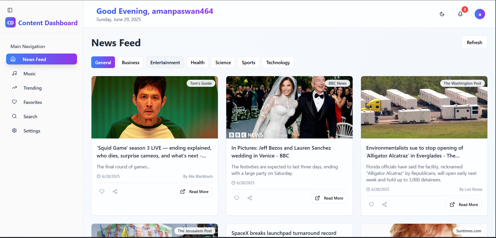
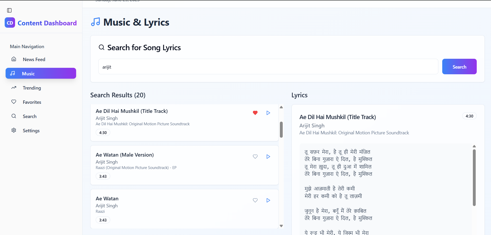

# Content Dashboard

A modern, responsive web application that serves as your personalized news and music hub. Built with React, TypeScript, and Tailwind CSS, featuring a beautiful dark/light theme system and comprehensive content management.


### Getting Started
1. **Sign Up/Login**: Create an account or sign in with Google
2. **Explore News**: Browse the latest news in the News Feed section
3. **Discover Trending**: Check out what's trending in the Trending section
4. **Search Content**: Use the search feature to find specific articles
5. **Save Favorites**: Heart articles and music tracks you want to save
6. **Customize Settings**: Adjust your preferences in the Settings section

---

### 📸 Screenshots

#### 🔐 Sign-In Page


---

#### 📰 News Feed Page


---

#### 🎵 Music Section


---

## 🚀 Features

### 📰 News & Content Management
- **Real-time News Feed**: Stay updated with the latest news from various sources
- **Trending Section**: Discover what's trending with ranked content display
- **Advanced Search**: Find specific articles and content with powerful search functionality
- **Favorites System**: Save and organize your favorite articles and music tracks
- **Category Filtering**: Browse news by different categories (technology, sports, entertainment, etc.)

### 🎵 Music Integration
- **Music Discovery**: Explore and discover new music tracks
- **Music Favorites**: Create your personal music library
- **Track Management**: Organize and manage your music collection
- **Duration Display**: View track lengths and artist information

### 🔐 Authentication & User Management
- **Secure Authentication**: Sign in with Google or email
- **User Profiles**: Personalized user experience with profile management
- **Session Management**: Secure session handling and persistence
- **User Settings**: Customize your experience with personal preferences

### 🎨 User Interface & Experience
- **Responsive Design**: Works seamlessly on desktop, tablet, and mobile devices
- **Dark/Light Theme**: Toggle between beautiful dark and light themes
- **Collapsible Sidebar**: Space-efficient navigation with expandable sidebar
- **Smooth Animations**: Polished transitions and hover effects
- **Glass Morphism**: Modern backdrop blur effects throughout the interface
- **Gradient Accents**: Beautiful color gradients for visual appeal

### 🛠️ Technical Features
- **Real-time Updates**: Live content updates without page refresh
- **Local Storage**: Persistent user preferences and favorites
- **Error Handling**: Graceful error handling with user feedback
- **Performance Optimized**: Fast loading and smooth interactions
- **SEO Friendly**: Optimized meta tags and structure

## 🛠️ Technologies & Tools

### Frontend Framework
- **React 18** - Modern React with hooks and functional components
- **TypeScript** - Type-safe development for better code quality
- **Vite** - Fast build tool and development server

### Styling & UI
- **Tailwind CSS** - Utility-first CSS framework
- **Shadcn/ui** - Beautiful, accessible component library
- **Radix UI** - Headless UI primitives for complex components
- **Lucide React** - Beautiful icon library with 1000+ icons

### State Management & Data Fetching
- **Local Storage** - Client-side data persistence
- **Context API** - Global state management

### Authentication & Security
- **Custom Auth System** - Secure user authentication
- **Session Management** - Persistent user sessions
- **Protected Routes** - Route-level authentication

### Additional Libraries
- **React Router DOM** - Client-side routing
- **React Hook Form** - Form handling and validation
- **Date-fns** - Date manipulation utilities
- **Sonner** - Beautiful toast notifications
- **Recharts** - Data visualization charts

## 📦 Installation & Setup

### Prerequisites
- **Node.js** (version 16.0 or higher)
- **npm** or **yarn** package manager
- **Git** for version control

### Clone the Repository
```bash
git clone https://github.com/aman0603/content-dashboard.git
cd content-dashboard
```

### Install Dependencies
```bash
# Using npm
npm install

# Or using yarn
yarn install
```

### Development Server
```bash
# Using npm
npm run dev

# Or using yarn
yarn dev
```

The application will be available at `http://localhost:5173`


## 🔧 Configuration

### API Keys Required
1. **News API Key**: Get from [NewsAPI.org](https://newsapi.org)
   - Free tier: 1000 requests/day
   - Used for fetching news articles and trending content

2. **Google OAuth (Optional)**: For Google Sign-In
   - Create project in [Google Cloud Console](https://console.cloud.google.com)
   - Enable Google+ API
   - Create OAuth 2.0 credentials

### Customization Options
- **Theme Colors**: Modify theme colors in `tailwind.config.ts`
- **API Endpoints**: Update API endpoints in service files
- **Component Styling**: Customize components in the `components/` directory
- **Layout**: Modify sidebar items and navigation in `Sidebar.tsx`

## 📁 Project Structure

```
content-dashboard/
├── public/                 # Static assets
├── src/
│   ├── components/        # Reusable UI components
│   │   ├── ui/           # Shadcn/ui components
│   │   ├── Header.tsx    # Main header component
│   │   ├── Sidebar.tsx   # Navigation sidebar
│   │   └── ...           # Feature-specific components
│   ├── pages/            # Page components
│   ├── hooks/            # Custom React hooks
│   ├── lib/              # Utility functions
│   ├── services/         # API service functions
│   └── types/            # TypeScript type definitions
├── package.json          # Dependencies and scripts
├── tailwind.config.ts    # Tailwind CSS configuration
├── tsconfig.json         # TypeScript configuration
└── vite.config.ts        # Vite build configuration
```

## 🎯 Usage Guide

### Getting Started
1. **Sign Up/Login**: Create an account or sign in with Google
2. **Explore News**: Browse the latest news in the News Feed section
3. **Discover Trending**: Check out what's trending in the Trending section
4. **Search Content**: Use the search feature to find specific articles
5. **Save Favorites**: Heart articles and music tracks you want to save
6. **Customize Settings**: Adjust your preferences in the Settings section

### Navigation
- **Sidebar**: Use the collapsible sidebar to navigate between sections
- **Theme Toggle**: Switch between dark and light themes using the moon/sun icon
- **User Menu**: Access your profile and logout options from the avatar dropdown

### Responsive Design
- **Desktop**: Full sidebar with all features visible
- **Tablet**: Collapsible sidebar with touch-friendly interactions
- **Mobile**: Hamburger menu with optimized touch targets

## 🚀 Deployment

### Deploy to Vercel (Recommended)
1. Connect your GitHub repository to Vercel
2. Add environment variables in Vercel dashboard
3. Deploy with automatic builds on push

